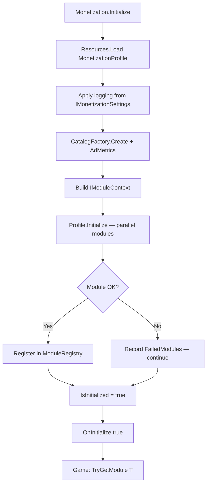
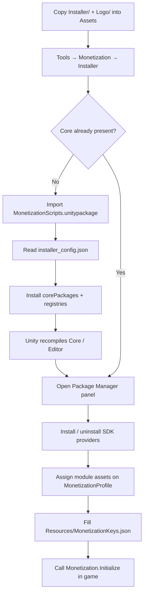

# Monetization System

A modular Unity monetization framework for ads, IAP, analytics, remote config, database, and storage. Game code depends only on **Core + Abstractions**; SDK providers are hot-swappable behind interfaces.

## Features

- **Modular providers** — isolated asmdefs, installer groups, optional UPM packages
- **Resilient init** — failed modules are logged and skipped; others continue
- **Async/await** — `UTask`-based initialization and ad flows
- **ScriptableObject config** — settings and modules live on `MonetizationProfile`
- **Safe module lookup** — prefer `TryGetModule<T>()` so missing providers never throw
- **Ad metrics** — load/show counts and timeouts via `IAdMetrics` / `PerformanceMonitor`

---

## Architecture

```
Monetization (static facade)
├── MonetizationProfile          // IMonetizationSettings + module list
│   ├── IAdsModule               // Google / AppLovin MAX
│   ├── IIAPModule               // Unity IAP
│   ├── IAnalyticsModule(+)      // GA / Firebase / Facebook / Tenjin
│   ├── IRemoteConfig<T>         // Firebase Remote Config
│   ├── IDatabaseModule          // Firebase Realtime Database
│   └── IStorageModule           // Firebase Cloud Storage
├── IModuleContext               // Settings + Catalog + AdMetrics
├── ModuleRegistry               // interface-keyed cache
└── CatalogFactory               // JsonKeyValueCatalog → MonetizationKeys.json
```

### Runtime initialization flow



### Install / bootstrap flow



---

## Providers

| Category | Interface | Installer id | Module |
|----------|-----------|--------------|--------|
| Ads | `IAdsModule` | `ads_google` | `GoogleAdsModule` |
| Ads | `IAdsModule` | `ads_applovin` | `AppLovinMaxAdsModule` |
| IAP | `IIAPModule` | `iap_unity` | `UnityIAPModule` |
| Analytics | `IAnalyticsModule` / markers | `analytics_gameanalytics` | `GAAnalyticsModule` |
| Analytics | | `analytics_firebase` | `FAAnalyticsModule` |
| Analytics | | `analytics_facebook` | `FacebookAnalyticsModule` |
| Analytics | | `analytics_tenjin` | `TenjinAnalyticsModule` |
| Remote Config | `IRemoteConfig<T>` | `remoteconfig_firebase` | `FirebaseRemoteConfig` |
| Database | `IDatabaseModule` | `database_firebase` | `FirebaseDatabaseModule` |
| Storage | `IStorageModule` | `storage_firebase` | `FirebaseStorageModule` |

---

## Integration guide

### 1. Bootstrap install

1. Copy `Assets/Monetization/Installer/` and `Assets/Monetization/Logo/` into an empty (or target) project.
2. Open **Tools → Monetization → Installer**.
3. Click **Install Monetization**.

The installer:

1. Imports `Installer/MonetizationScripts.unitypackage`
2. Reads `Installer/installer_config.json` and installs **core** UPM packages + registries (UTask, OpenUPM, etc.)
3. Opens the **Package Manager** panel after compilation

If Core is already present, the same menu opens the Package Manager directly.

### 2. Install providers

In the Package Manager panel, install the SDK providers you need. Local Firebase archives are copied from `Installer/Dependencies/*.tgz` when configured.

| Provider note | Detail |
|---------------|--------|
| GameAnalytics | Use UPM `com.gameanalytics.sdk` via installer — not the legacy `.unitypackage` |
| Tenjin | Git UPM: `https://github.com/tenjin/tenjin-unity-sdk.git#1.16.5` |
| Facebook | Often imported manually (`FacebookSDK.unitypackage`) unless you vendor a tgz |

See [`Installer/EXPORT.md`](Installer/EXPORT.md) for unitypackage export rules. Maintainers: Dev tools live under [`Dev/`](Dev/) (`Tools → Monetization Dev`).

### 3. Configure assets

| Asset | Path | Purpose |
|-------|------|---------|
| Profile | `Resources/MonetizationProfile.asset` | Settings (`IMonetizationSettings`) + assigned modules — **required** |
| Keys | `Resources/MonetizationKeys.json` | Ad / IAP / analytics / project keys |
| RC mapper | `Content/FireBaseVariableMapper.asset` | Assign on Firebase Remote Config module |

Create a profile via **Create → THEBADDEST → MonetizationApi → MonetizationProfile** if needed, place it under `Resources/`, and assign provider module ScriptableObjects.

**AppLovin MAX** — set the SDK key in `MonetizationKeys.json`:

```json
{
  "AdKeys": {
    "MaxSdkKey": "your-applovin-max-sdk-key"
  }
}
```

Optional editor actions on the profile inspector:

- **Sync Project** — package name, version, keystore from `ProjectKeys`, and IAP catalog via each `IAPModule.ApplyCatalogFromJson()`  
Build-time: `BuildProcessor` also calls `ProjectSettingsSync.SyncFromJson()`.

### 4. Initialize

```csharp
using THEBADDEST.MonetizationApi;
using THEBADDEST.MonetizationApi.Ads;

public class GameManager : MonoBehaviour
{
    async void Start()
    {
        Monetization.OnInitialize += OnMonetizationInitialized;
        await Monetization.Initialize();
    }

    void OnMonetizationInitialized(bool success)
    {
        if (!success) return;

        if (Monetization.TryGetModule<IAdsModule>(out var ads))
        {
            ads.LoadInterstitial();
        }
    }
}
```

Demo reference: `Demo/Test.cs` + `Demo/Test.unity`.

### 5. Use modules

Always prefer `TryGetModule` so missing providers never throw:

```csharp
if (Monetization.TryGetModule<IAdsModule>(out var ads))
{
    ads.OnSdkReady += ok => Debug.Log($"Ads SDK ready: {ok}");
    ads.ShowInterstitial();
}

if (Monetization.TryGetModule<IIAPModule>(out var iap))
{
    iap.Purchase("product_id", OnSuccess, OnFail);
}

Analytics.SendEvent("level_complete", AnalyticsProviders.GameAnalytics | AnalyticsProviders.Firebase);

if (Monetization.TryGetModule<ITenjinAnalyticsModule>(out var tenjin))
{
    tenjin.SendAdImpression("applovin", 0.015d, "interstitial_home");
}

if (Monetization.TryGetModule<IRemoteConfig<object>>(out var remoteConfig))
{
    remoteConfig.FetchConfig(config => Debug.Log("Config loaded"));
}

if (Monetization.TryGetModule<IDatabaseModule>(out var database))
{
    database.SetValue("players/1/score", 100, ok => Debug.Log($"Saved: {ok}"));
}

if (Monetization.TryGetModule<IStorageModule>(out var storage))
{
    storage.UploadBytes("avatars/user.png", imageBytes, ok => Debug.Log($"Uploaded: {ok}"));
}
```

After init, check partial failures:

```csharp
await Monetization.Initialize();
foreach (string failure in Monetization.FailedModules)
{
    Debug.LogWarning(failure);
}
```

`Monetization.OnError` fires with a summary when any module fails (non-throwing).

---

## Analytics routing

Game code owns where events go. Automatic ad-event routing was removed from base analytics modules.

```csharp
Analytics.SendEvent("level_complete", AnalyticsProviders.GameAnalytics | AnalyticsProviders.Firebase);

if (Monetization.TryGetModule<IFacebookAnalyticsModule>(out var facebook))
{
    facebook.LogPurchase(4.99f, "USD");
}
```

For orchestration (ad events, IAP forwarding):

- `Monetization.GetModules<IAnalyticsModule>()` — iterate available modules
- Marker interfaces: `IGAAnalyticsModule`, `IFirebaseAnalyticsModule`, `IFacebookAnalyticsModule`, `ITenjinAnalyticsModule`

---

## Swapping providers

1. Implement `IAdsModule` (or other abstraction) in a new folder + asmdef that references **Abstractions only**.
2. Add an installer provider entry in `Installer/installer_config.json`.
3. Swap the module asset on `MonetizationProfile`.
4. Game code stays on `TryGetModule<IAdsModule>()` — no Core changes.

**Hot-swap checklist**

1. **Tools → Monetization → Validate Hot-Swap Readiness**
2. Uninstall provider UPM packages via Installer; remove provider folder/asmdef if needed
3. Remove or swap the module asset on the profile
4. Confirm game asmdefs reference **Core + Abstractions only** (never concrete provider types)
5. Core + Abstractions must compile with zero SDK references

---

## Performance monitoring

```csharp
var snapshot = PerformanceMonitor.Instance.GetAdMetrics(AdMetricsTypes.Interstitial);
Debug.Log($"Shows={snapshot.ShowCount}, LoadSuccess={snapshot.LoadSuccessCount}");

if (Monetization.TryGetModule<IAdsModule>(out var ads))
{
    int showCount = ads.GetInterstitialShowCount();
}
```

Ad loads respect `IAdsModule.AdLoadTimeout` via built-in timeout watchers.

---

## Extending — new ad network

```csharp
public class CustomAdsModule : AdsModule
{
    protected override async UTask OnInitialize()
    {
        // Initialize SDK, then RaiseAdsSdkReady(true);
        await UTask.CompletedTask;
    }

    public override IAppAd FetchInterstitial(string placement = "default") { /* ... */ }
    // Implement remaining IAdsModule members
}
```

---

## Troubleshooting

| Issue | Fix |
|-------|-----|
| `TryGetModule<IAdsModule>` returns false | Install ads provider; assign module on `MonetizationProfile` |
| Profile not found at runtime | Ensure asset is named/placed so `Resources.Load("MonetizationProfile")` works |
| IAP catalog empty | **Sync Project** on profile inspector (runs `IAPModule.ApplyCatalogFromJson`) or fill `IAPKeys` in keys JSON |
| Firebase RC mapper missing | Assign `Content/FireBaseVariableMapper.asset` on the RC module |
| Profile warns about missing asmdef | Re-install provider via Installer or remove module from profile |
| GA compile errors after install | Use UPM `com.gameanalytics.sdk`, not legacy unitypackage |
| Settings / `MonetizationConfig` missing | Config SO was removed — use settings on `MonetizationProfile` (`IMonetizationSettings`) |

---

## Migration notes (v4.1)

- **`MonetizationConfig` removed** — logging, timeouts, retries, and test mode live on `MonetizationProfile` / `IMonetizationSettings`
- **`IPlacementCatalog` removed** — use `IKeyValueCatalog` / JSON catalog from `MonetizationKeys.json`
- Prefer **`OnSdkReady`** for SDK readiness (lifecycle `OnInitialize` on modules is separate)
- Init builds an **`IModuleContext`** (settings + catalog + ad metrics) shared by all modules

---

## Version History

- **v4.1**: Profile settings (`IMonetizationSettings` / `IModuleContext`); `MonetizationConfig` removed; catalog via `IKeyValueCatalog`
- **v4.0b Phase 2**: Asmdef split, hot-swappable providers, resilient init, `TryGetModule`, `OnSdkReady`, runtime services
- **v4.0b Phase 1**: Unified lifecycle, ad metrics, editor-safe module lookup

## License

MIT License — see LICENSE for details.
